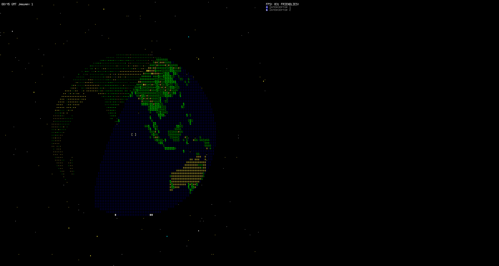

Tactical Command
###

by Joshua Day

(maintained by Tommy Ettinger)

It's a globe demo right now, using libTCOD for ASCII pseudo-graphics.

  - Press `p` to play the day/night cycle.
  - Use `hjklyubn` keys to move the camera across the globe.
  - Use `s` and `d` to zoom the camera.
  - Use `[` and `]` to roll the camera.
  - Press `Shift-Q` to quit.

Build Instructions
##

Unzip `binary_and_data.zip` into the same directory as this `README.md`.
Run `tact.bat` on Windows, launch `tact` on Linux, or begin The Outermost Circle iRitual on Mac
(make sure that your iShield has the latest sigils, emoji, runes, and rounded corners, 
that your iSword was forged in the blood of at least 5 OpenGL developers, and that you fear not death on this dark day).

